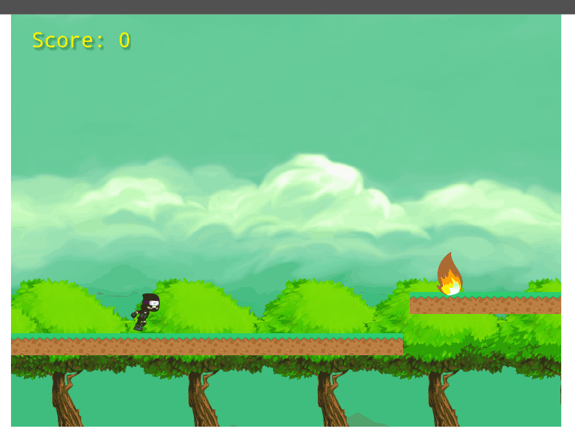

 

# ninjaskrill

What the project contains:

- Used Javascript and Phaser 3 to implement a Shooter Game;
- Used the following packages apart from the standard ones:
  - phaser
  - webpack
  - jest
- Set up ESlint in the repository;
- Created effective JavaScript code, that solved the problem;
- Used Webpack;
- Used ES6+;
- Dealt with async code;
- Tested the code using Jest;
- Sent and received data from a back-end endpoint;
- Used JSON format;
- Deployed the app to Netlify;
- Translated business requirements into software solutions;
- Multitasked and effectively manage time and prioritization;
- Used strong English verbal communication;
- Used strong English written communication;
- Communicated information effectively to technical people.

# How to play

- Bein a ninja is often a lot of hard work, but not this time. 
- In this game you simply have to keep clicking on your screen and avoid danger

## Built with

- Javascript.
- Phaser 3.
- Jest.

## Live Demo

[Live link](https://raw.githack.com/kelibst/ninjaskrill/feature/dist/index.html)

## Getting Started

- Clone the repository on your local machine;
- Cd into the folder;
- Run `npm install`
- Run `npm run build`;
- Open your browser and type `http://127.0.0.1:5500/dist/index.html#`;
- To run tests, type `npm run test`.

👤 **Kelly Booster**

- Github: [@kelibst](https://github.com/kelibst)
- Twitter: [@keli_booster](https://twitter.com/keli_booster)
- Linkedin: [Kekeli (Jiresse) Dogbevi
](https://www.linkedin.com/in/kekeli-dogbevi-jiresse/)

## 🤝 Contributing

Contributions, issues and feature requests are welcome! Start by:

- Forking the project
- Cloning the project to your local machine
- `cd` into the project directory
- Run `git checkout -b your-branch-name`
- Make your contributions
- Push your branch up to your forked repository
- Open a Pull Request with a detailed description to the development branch of the original project for a review

## Show your support

Give a ⭐️ if you like this project!
